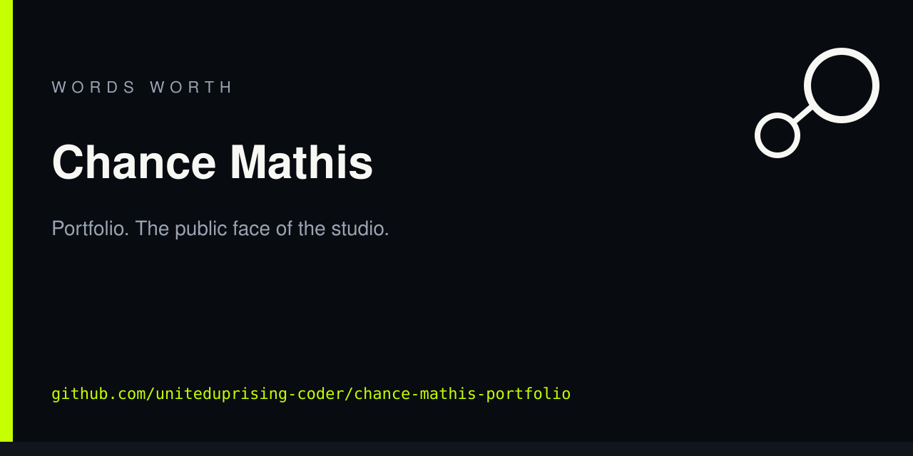

<!-- ww-card:start -->

  

  

  <a href="https://github.com/uniteduprising-coder/chance-mathis-portfolio"><b>Open repo</b></a>
  · <a href="https://uniteduprising-coder.github.io/ww-hub/">Hub</a>
  · <a href="https://github.com/uniteduprising-coder">All work</a>
  · <a href="https://github.com/uniteduprising-coder/chance-mathis-portfolio">Live / home</a>

# Chance Mathis

Portfolio. The public face of the studio.

Scan the square or tap a link. Same card on every Wordsworth / United Uprising repo.

<!-- ww-card:end -->

# Chance Mathis — Forward-Deployed Engineering Portfolio

Public technical portfolio for Chance Mathis.

This repository is intentionally narrow: it presents selected engineering work suitable for professional review without exposing unrelated private research or internal systems.

## Featured technical artifact

**Deterministic Trace Compression** — a rule-based preprocessing layer for repetitive build, test, and tool traces. The public snapshot demonstrates structural template collapse, reversible alias compression, explicit lossy markers, token-benefit gating, and regression checks for fidelity.

## Portfolio

Open `index.html` for the full portfolio experience.

## Contact

- LinkedIn: https://www.linkedin.com/in/chance-mathis-a926a4106
- Email: chance@uniteduprising.com
